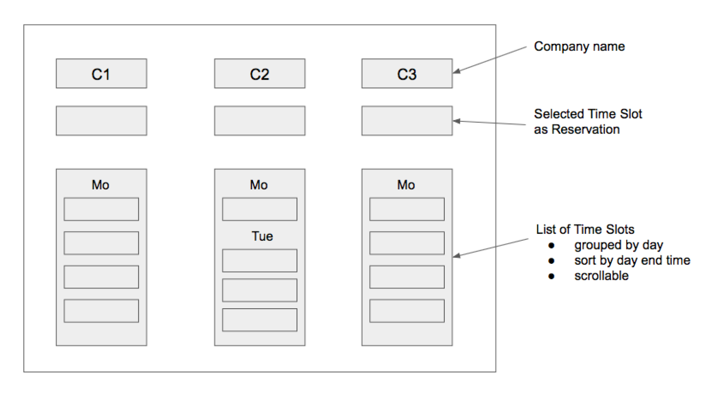
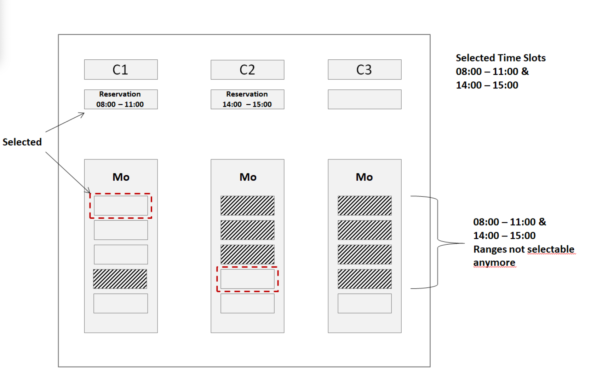

# Time Slot Reservation System

A dynamic and user-friendly web application for scheduling and managing time slot reservations.

[LIVE](https://timeslot-picker.vercel.app/)


## Introduction

This React-based web application is designed to improve the interaction between call center agents and customers by facilitating an efficient time slot reservation process. It aims to provide a seamless experience for agents to select and manage time slots for various companies.





## Technologies Used

-   `React`
-   `Tailwind CSS` for styling
-   `classnames` for easy conditional class names
-   `Zustand` for state management
-   `JSON Server` for mock REST API
-   `Jest`, `Prettier`, `ESLint` for testing and development

## Project Background

This project was developed as a part of a technical assessment challenge. The key requirements were:

-   Create a REST API to serve time slots.
-   Build a React application to fetch and display time slots.
-   Implement a user-friendly interface for selecting and reserving time slots.
-   Ensure reservation functionality is intuitive and efficient.

The project focuses on providing a solution that is both functionally robust and user-friendly.

## Features

-   Interactive UI for selecting time slots.
-   Time slots displayed in a human-readable format, sorted and grouped by date.
-   Functionality to set, highlight, and deselect reservations.
-   Blocking of conflicting time slots across companies.

## Not implemented features (Scoping down)

-   Range selection

## Challenges and Solutions

-   **Challenge 1**: Efficiently managing state across multiple components.
    -   **Solution**: Used Zustand for global state management to synchronize state across components.

## What I Learned

-   State management in React via Zustand.
-   You can serve your JSON files from rest via RESTful APIs with `JSON Server`.
-   Deeper insights into creating responsive and user-friendly interfaces with Tailwind CSS.

## Thought Process

### What is the Data Structure

Understanding the structure of data provided in the JSON was crucial. Key considerations were:

-   Are all timeslots of the same duration?
-   Do all companies have the same timeslots?
-   Do timeslots vary by day?
-   Does the backend provide information on timeslots already booked?

After analysis, it was concluded:

-   Each timeslot has a 1.5-hour duration.
-   Timeslots vary from company to company and day by day.
-   The provided data doesn't include booked timeslots but can be adapted to show this.

### Presenting the Layout and Components

The design process led to the decision to use two primary components for clean and efficient code:

-   `CompanyComponent`
-   `TimeslotComponent`

The business logic dictated that each company should have only one selected timeslot, which should block the same timeslot in other companies. This interactivity between `TimeslotComponents` was best managed using a global store.

### Structuring Date Data

The aim was to restructure the date data to be more meaningful and intuitive:

_First approach:_

```js
{
  Monday: [{start_time: 'xx', end_time: 'yy'}, ...],
  Wednesday: [{start_time: 'xx', end_time: 'yy'}, ...]
}
```

Challenges with this approach:

-   Handling data spanning multiple months or years.
-   Dealing with timeslots that cross over to the next day.

_Second approach:_

```js
{
  "20-01-2022": [{start_time: 'xx', end_time: 'yy'}, ...],
  "21-01-2022": [{start_time: 'xx', end_time: 'yy'}, ...]
}
```

This approach simplifies identifying specific days, making data handling more straightforward.

## Future Improvements

-   Implement time range selection
-   Implementation of real-time updates for time slot availability with sockets.
-   Better accessibility and a11y features

## Initial completion date and duration spent

Monday, the 14th of February 2022 - 10hours
